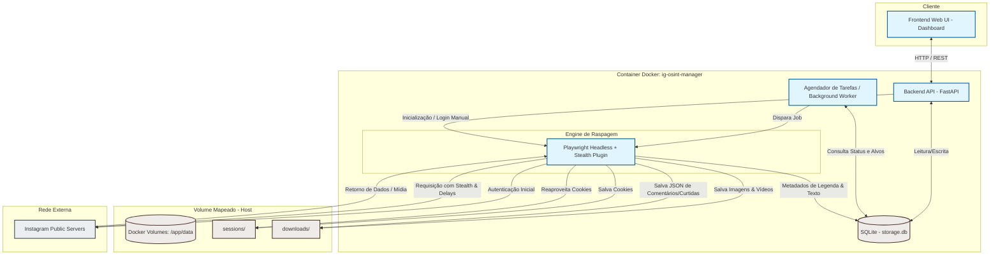
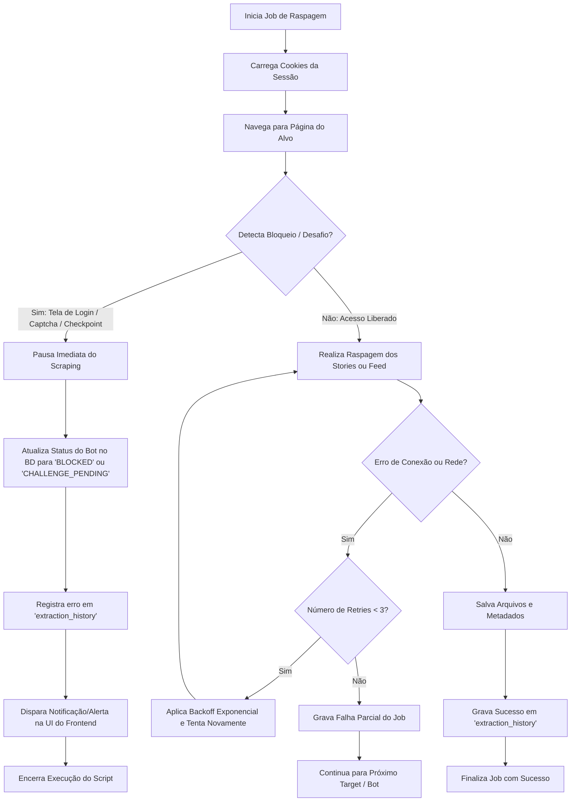

# Especificação Técnica do Sistema: IG-OSINT Manager

* **Padrão:** Spec-Driven Development (SDD) / spec-kit Framework
* **Status:** Pronto para Ingestão de Agents (`ag-kit`)
* **Data da Última Revisão:** 31 de Maio de 2026

---

## 1. Visão Geral do Sistema e Objetivos

O **IG-OSINT Manager** é uma plataforma de inteligência competitiva de código aberto e extração automatizada de dados públicos (Social Listening & OSINT) focada no Instagram. O objetivo principal do sistema é encapsular a complexidade associada à raspagem automatizada e periódica de perfis públicos (incluindo Stories, Feeds, Reels, comentários e metadados de engajamento), estruturando essas informações de forma higienizada e persistente para viabilizar análises avançadas (como processamento de linguagem natural, análise de sentimento e descoberta de tendências).

A plataforma oferece uma interface gráfica Web simples para gerenciamento operacional de alvos monitorados, acompanhamento em tempo real dos logs de coleta, e provisionamento de credenciais e cookies de sessão de contas bot de forma isolada, resiliente e conteinerizada.

---

## 2. Arquitetura de Software e Fluxo de Dados

A arquitetura do sistema baseia-se em um modelo conteinerizado de microsserviços internos integrados, divididos em três camadas fundamentais:

1. **Camada de Apresentação (Frontend Web UI):** Interface de controle de operação em Vanilla JS / HTML / CSS para gerenciamento de alvos, bots e logs.
2. **Camada de Orquestração e Extração (Backend API & Worker):** API baseada em FastAPI (Python) que expõe endpoints de gerenciamento e orquestra um agendador de tarefas em segundo plano (Worker/Cron) encarregado de disparar a engine de raspagem com Playwright Stealth.
3. **Camada de Persistência (Híbrida):** Banco de dados relacional leve (SQLite) para dados estruturados/metadados e armazenamento direto em disco via volumes Docker para mídias físicas (vídeos e imagens) e arquivos JSON brutos.

### Diagrama Arquitetural e Pipeline de Dados



---

## 3. Requisitos do Sistema

### 3.1 Requisitos Funcionais (RF)

| ID | Nome | Descrição | Rastreabilidade / Critério de Aceitação |
| :--- | :--- | :--- | :--- |
| **RF-001** | Cadastro de Credenciais de Bots | O sistema deve permitir o cadastro de contas bot do Instagram (Username e Password) por meio da interface gráfica. | Armazenar com segurança no banco de dados local. |
| **RF-002** | Validação Interativa de Login | O sistema deve disponibilizar um botão para iniciar um fluxo interativo manual de login (via Playwright) para gerar o Arquivo de Sessão inicial e responder a eventuais desafios (captchas ou 2FA). | Geração e escrita do arquivo `.json` de sessão correspondente em `sessions/`. |
| **RF-003** | Gerenciamento de Alvos (Targets) | A interface deve permitir cadastrar, editar, listar e desativar perfis públicos do Instagram (alvos) sob monitoramento (@username), com flags para especificar o que coletar (Feed, Stories, Comentários, Likes). | Cadastro armazenado na tabela `scraping_targets`. |
| **RF-004** | Raspagem Automatizada de Stories | O worker em background deve rodar a cada 1 hora para buscar, baixar e processar Stories de perfis ativos cujo flag `download_stories` esteja habilitado. | Coleta incremental: Stories já baixados e com IDs iguais no diretório local são ignorados. |
| **RF-005** | Raspagem Incremental de Feed e Reels | O worker em background deve rodar uma vez por dia (idealmente de madrugada) para coletar posts do Feed e Reels de perfis com `download_feed` ativado. | O scraper deve parar imediatamente a paginação no momento em que encontrar o primeiro ID de post que já consta na base local. |
| **RF-006** | Extração de Metadados Textuais e Interações | O scraper deve extrair legendas de posts, listas de utilizadores que curtiram e comentários detalhados dos posts baixados. | Legendas devem ser inseridas no banco, e comentários/likes persistidos estruturalmente. |
| **RF-007** | Busca Avançada Textual Indexada | A aplicação deve expor uma barra de pesquisa na UI que permita realizar consultas de texto completo rápidas sobre as legendas e comentários coletados. | Utilização da extensão SQLite FTS5 para indexação imediata. |
| **RF-008** | Visualizador de Logs Operacionais | O painel Web deve fornecer visualização dinâmica e histórica dos logs de execução de tarefas (`crawler.log`) sob demanda. | Os logs de scraping devem ser expostos via endpoint HTTP `/api/logs` formatados para a UI. |

### 3.2 Requisitos Não-Funcionais (RNF)

| ID | Nome | Descrição | Rastreabilidade / Critério de Aceitação |
| :--- | :--- | :--- | :--- |
| **RNF-001** | Resiliência de Rede e Retries | Todas as requisições HTTP e downloads de mídia devem implementar uma política de retry com recuo exponencial (*exponential backoff*) em caso de falha temporária. | Máximo de 3 tentativas por requisição antes de marcar como falha parcial do job. |
| **RNF-002** | Tolerância a Falhas e Detecção de *Soft Block* | O scraper deve detectar telas de checkpoint, desafios de segurança e mensagens de erro de rate limit do Instagram (Soft Blocks). | Em caso de Soft Block, o scraper deve pausar o bot imediatamente, mudar o status do bot para `BLOCKED` e registrar o erro em `extraction_history`. |
| **RNF-003** | Evasão de Detecção (Antiban) | O scraper Playwright deve rodar ocultando comportamentos de automação usando assinaturas reais de navegadores e injeção de padrões humanos. | Integração do pacote `playwright-stealth` e controle estrito de *User-Agent* e tamanho de viewport. |
| **RNF-004** | Persistência Híbrida e Independência de Container | O banco de dados SQLite e todos os downloads de mídias/arquivos de sessão devem residir em volumes externos mapeados no host. | O container deve ser descartável e atualizável sem perda de qualquer dado. |
| **RNF-005** | Armazenamento Seguro de Credenciais | As senhas e arquivos de sessão persistidos dos bots do Instagram não podem ser gravados em texto claro na base de dados SQLite. | Criptografia simétrica usando AES-256-GCM com chave de decodificação obtida dinamicamente via variável de ambiente `ENCRYPTION_KEY`. |
| **RNF-006** | Isolamento de Rede | A rede interna do container Docker deve restringir acessos. O container expõe exclusivamente a porta da aplicação Web (HTTP 8000). | O banco SQLite e os processos secundários do worker rodam localmente dentro do container, sem exposição de portas de depuração. |
| **RNF-007** | Performance de Busca Textual | As buscas por palavras-chave via FTS5 nas legendas indexadas devem retornar resultados em menos de 500 milissegundos. | Indexação automática na tabela virtual FTS5 durante a inserção de novos registros. |
| **RNF-008** | Portabilidade e Conteinerização | A solução completa deve ser orquestrável através do Docker Compose, garantindo funcionamento idêntico em ambientes de desenvolvimento local (ex: Linux Mint/Ubuntu) e produção (VPS). | Execução consistente com apenas um comando `docker compose up --build`. |

---

## 4. Modelagem de Dados e Esquema de Persistência (SQLite)

O banco de dados do sistema será um arquivo SQLite denominado `storage.db`, localizado no diretório raiz do volume compartilhado. O schema abaixo define a estrutura física relacional que garante o rastreamento das operações e a indexação eficiente.

```sql
-- Habilita suporte a chaves estrangeiras no SQLite
PRAGMA foreign_keys = ON;

-- 1. Tabela de Credenciais e Estados dos Bots do Instagram
CREATE TABLE IF NOT EXISTS instagram_bots (
    id INTEGER PRIMARY KEY AUTOINCREMENT,
    username TEXT NOT NULL UNIQUE,
    password_encrypted TEXT NOT NULL,         -- Senha criptografada com AES-256-GCM
    status TEXT NOT NULL DEFAULT 'ACTIVE',    -- ACTIVE, BLOCKED, CHALLENGE_PENDING, EXPIRED
    session_file_name TEXT,                   -- Caminho do arquivo contendo os cookies de sessão
    last_used_at TEXT,                        -- Timestamp ISO 8601 da última utilização
    created_at TEXT NOT NULL DEFAULT (datetime('now', 'localtime')),
    updated_at TEXT NOT NULL DEFAULT (datetime('now', 'localtime'))
);

-- 2. Tabela de Alvos (Targets) a serem Monitorados
CREATE TABLE IF NOT EXISTS scraping_targets (
    id INTEGER PRIMARY KEY AUTOINCREMENT,
    username TEXT NOT NULL UNIQUE,            -- @username do alvo (ex: 'artista_famoso')
    instagram_id TEXT,                        -- ID numérico interno do Instagram (se conhecido)
    download_feed INTEGER NOT NULL DEFAULT 1, -- Flag boleano (0 ou 1)
    download_stories INTEGER NOT NULL DEFAULT 1, -- Flag boleano (0 ou 1)
    download_comments INTEGER NOT NULL DEFAULT 0, -- Flag boleano (0 ou 1)
    download_likes INTEGER NOT NULL DEFAULT 0, -- Flag boleano (0 ou 1)
    check_frequency_hours INTEGER DEFAULT 24, -- Frequência para execução do feed (padrão: 24h)
    is_active INTEGER NOT NULL DEFAULT 1,     -- Ativo para raspagem automática (0 ou 1)
    last_scraped_at TEXT,                     -- Timestamp ISO 8601 da última raspagem bem sucedida
    created_at TEXT NOT NULL DEFAULT (datetime('now', 'localtime')),
    updated_at TEXT NOT NULL DEFAULT (datetime('now', 'localtime'))
);

-- 3. Histórico de Execuções e Jobs (Auditoria de Scraping)
CREATE TABLE IF NOT EXISTS extraction_history (
    id INTEGER PRIMARY KEY AUTOINCREMENT,
    target_id INTEGER,
    bot_id INTEGER,
    job_type TEXT NOT NULL,                  -- STORIES, FEED, COMMENTS, LIKES
    status TEXT NOT NULL,                     -- SUCCESS, FAILED, PARTIAL_BLOCK
    items_scraped INTEGER DEFAULT 0,          -- Contagem de itens coletados no Job
    error_message TEXT,                       -- Detalhamento de erros de rede ou bloqueio
    started_at TEXT NOT NULL,                 -- Timestamp ISO 8601 de início
    completed_at TEXT,                        -- Timestamp ISO 8601 de conclusão
    FOREIGN KEY (target_id) REFERENCES scraping_targets(id) ON DELETE SET NULL,
    FOREIGN KEY (bot_id) REFERENCES instagram_bots(id) ON DELETE SET NULL
);

-- 4. Tabela de Metadados Básicos dos Posts Raspados
CREATE TABLE IF NOT EXISTS instagram_posts (
    post_id TEXT PRIMARY KEY,                 -- ID único da mídia do Instagram (Shortcode)
    target_id INTEGER NOT NULL,
    post_type TEXT NOT NULL,                  -- IMAGE, VIDEO, CAROUSEL, REELS
    caption TEXT,                             -- Texto da legenda original
    taken_at TEXT NOT NULL,                   -- Timestamp de postagem original do post
    like_count INTEGER DEFAULT 0,
    comment_count INTEGER DEFAULT 0,
    media_url TEXT,                           -- URL CDN original (temporária)
    local_path TEXT NOT NULL,                 -- Caminho relativo no volume para o arquivo local
    created_at TEXT NOT NULL DEFAULT (datetime('now', 'localtime')),
    FOREIGN KEY (target_id) REFERENCES scraping_targets(id) ON DELETE CASCADE
);

-- 5. Tabela Virtual FTS5 (Full-Text Search) para Indexação Rápida de Texto
CREATE VIRTUAL TABLE IF NOT EXISTS posts_fts USING fts5(
    post_id UNINDEXED,                        -- ID do post (não indexado no FTS, serve apenas para JOIN)
    target_username,                          -- Username do autor do post
    caption,                                  -- Legenda do Post
    comments_sample                           -- Amostra de comentários agregados para busca semântica livre
);
```

### Gatilhos de Sincronização Automatizada do FTS5
Para manter a tabela virtual de busca textual FTS5 sempre sincronizada sem sobrecarregar a lógica da aplicação, são definidos triggers no SQLite:

```sql
-- Sincronização após INSERÇÃO de post
CREATE TRIGGER IF NOT EXISTS trg_posts_fts_insert AFTER INSERT ON instagram_posts
BEGIN
    INSERT INTO posts_fts (post_id, target_username, caption, comments_sample)
    VALUES (
        new.post_id,
        (SELECT username FROM scraping_targets WHERE id = new.target_id),
        new.caption,
        '' -- Inicializado vazio, atualizado conforme comentários são persistidos
    );
END;

-- Sincronização após EXCLUSÃO de post
CREATE TRIGGER IF NOT EXISTS trg_posts_fts_delete AFTER DELETE ON instagram_posts
BEGIN
    DELETE FROM posts_fts WHERE post_id = old.post_id;
END;
```

---

## 5. Estrutura de Arquivos no Volume Mapeado

A árvore de diretórios persistida de forma definitiva no sistema operacional hospedeiro (`host`) via volumes mapeados seguirá o padrão semântico abaixo:

```text
/dados_instagram_volume/ (Raiz do Volume)
├── storage.db                            # Banco de dados SQLite contendo todo o histórico e índices FTS5
├── sessions/                             # Diretório de arquivos de cookies de sessão
│   ├── session_bot_user_1.json           # Cookies serializados da conta bot 1 (Playwright Context State)
│   └── session_bot_user_2.json           # Cookies serializados da conta bot 2
└── downloads/                            # Conteúdo de mídia física e dados em formato bruto
    ├── @perfil_artista_1/                # Pasta individualizada de cada alvo cadastrado
    │   ├── stories/
    │   │   ├── 2026-05-31_14-00-00_story_123456789.jpg   # Imagem de Story com timestamp e ID do Instagram
    │   │   └── 2026-05-31_14-15-00_story_987654321.mp4   # Vídeo de Story com timestamp
    │   └── feed/
    │       ├── 2026-05-30_feed_abc123.mp4               # Reels ou Vídeo de Post
    │       ├── 2026-05-30_feed_abc123.jpg               # Imagem do post
    │       ├── 2026-05-30_feed_abc123_meta.json         # Dump completo do dicionário JSON retornado
    │       └── 2026-05-30_feed_abc123_comments.json     # Todos os comentários e likes extraídos
    └── @perfil_artista_2/
```

---

## 6. Estratégias de Evasão (Antiban) e Resiliência

Para mitigar a detecção automática e estender ao máximo a vida útil das contas de bot cadastradas, o sistema implementará as seguintes rotinas de evasão ativa:

### 6.1 Gestão de Sessões Persistentes
* **Login Mínimo:** A autenticação enviando credenciais de texto claro (Usuário/Senha) deve ocorrer **estritamente uma única vez** durante o cadastro ou após a invalidação definitiva dos tokens de sessão.
* **Persistência de Estado do Browser:** O Playwright deve salvar o estado completo do contexto (`browser_context.storage_state(path=session_file_path)`), incluindo cookies, localStorage e sessionStorage. Todos os jobs subsequentes (horários ou diários) inicializarão o contexto a partir deste arquivo local.

### 6.2 Algoritmo de Jitter e Delays Aleatórios
* **Delays Dinâmicos:** A injeção de atrasos entre ações de navegação (como paginação de comentários, scroll e troca de abas) deve seguir uma distribuição aleatória para imitar o comportamento humano:
  $$\Delta t = \text{random\_uniform}(10.0, 25.0) \text{ segundos}$$
* **Pausas de Descanso (Cooldown):** A cada 30 mídias baixadas ou comentários paginados, o scraper deve disparar uma pausa prolongada de "leitura simulada":
  $$\text{Cooldown} = \text{random\_uniform}(120, 300) \text{ segundos}$$

### 6.3 Tratamento de Bloqueios (Soft Blocks / Checkpoints)
O fluxo do scraper durante a detecção de anomalias seguirá o diagrama lógico abaixo:



---

## 7. Especificação de Segurança da Informação

### 7.1 Criptografia Simétrica de Senhas
As senhas das contas bot não devem ser acessíveis por pessoas que tenham acesso direto de leitura ao arquivo `storage.db`.
* **Algoritmo:** AES-256-GCM (Advanced Encryption Standard em modo Galois/Counter Mode), garantindo sigilo e integridade.
* **Geração de Chave:** A chave secreta simétrica deve ser configurada através de uma variável de ambiente obrigatória: `ENCRYPTION_KEY`.
* **Tratamento de Erros:** O backend da aplicação Web deve se recusar a subir e emitir um log de erro crítico se `ENCRYPTION_KEY` estiver ausente ou tiver menos de 32 bytes (256 bits).

### 7.2 Isolamento de Rede no Docker
Para minimizar a superfície de ataque da aplicação conteinerizada:
* O banco de dados SQLite é local e não expõe conexões de socket de rede para fora do container.
* A interface gráfica Web expõe estritamente a porta `8000`.
* Não são expostas portas de depuração para Playwright ou bancos de dados adicionais.

---

## 8. Infraestrutura e Conteinerização

### 8.1 Dockerfile Produtivo
O arquivo `Dockerfile` configura o ambiente isolado do Linux Debian-Slim com todos os drivers gráficos necessários para a execução estável do Chromium sem tela ativa (Headless).

```dockerfile
FROM python:3.11-slim

# Evita a geração de arquivos .pyc e força stdout sem buffer para logs limpos
ENV PYTHONDONTWRITEBYTECODE=1
ENV PYTHONUNBUFFERED=1

# Instala pacotes do sistema necessários para Playwright Chromium Headless e Cron
RUN apt-get update && apt-get install -y \
    cron \
    libnss3 \
    libnspr4 \
    libatk1.0-0 \
    libatk-bridge2.0-0 \
    libcups2 \
    libdrm2 \
    libxkbcommon0 \
    libxcomposite1 \
    libxdamage1 \
    libxext6 \
    libxfixes3 \
    librandr2 \
    libgbm1 \
    libpango-1.0-0 \
    libcairo2 \
    libasound2 \
    && rm -rf /var/lib/apt/lists/*

WORKDIR /app

# Copia dependências do Python e realiza instalação limpa
COPY requirements.txt .
RUN pip install --no-cache-dir -r requirements.txt

# Instala binários nativos do navegador Chromium via Playwright CLI
RUN playwright install chromium

# Copia todo o código-fonte
COPY . .

# Expõe exclusivamente a porta da Interface Gráfica e API FastAPI
EXPOSE 8000

# Executa o daemon do cron em background e sobe a aplicação principal
CMD ["sh", "-c", "cron && python main.py"]
```

### 8.2 Orquestração Multi-Ambiente (Docker Compose)
O arquivo `docker-compose.yml` mapeia a pasta física para gravação dos arquivos baixados no host e injeta as variáveis de ambiente necessárias.

```yaml
version: '3.8'

services:
  ig-osint-manager:
    build:
      context: .
      dockerfile: Dockerfile
    container_name: ig_osint_manager_app
    restart: always
    ports:
      - "8000:8000"
    volumes:
      # Volume mapeado no Host para garantir persistência absoluta
      - ./dados_instagram_volume:/app/data
    environment:
      - DATABASE_PATH=/app/data/storage.db
      - DOWNLOAD_DIR=/app/data/downloads
      - SESSION_DIR=/app/data/sessions
      - LOG_FILE_PATH=/app/data/crawler.log
      - ENCRYPTION_KEY=${ENCRYPTION_KEY:-minha_chave_secreta_padrao_de_32_bytes_} # Recomendado passar via .env
    security_opt:
      - no-new-privileges:true
```

---

## 9. Próximos Passos e Ingestão de Agentes (`ag-kit`)

Com esta especificação devidamente aprimorada e enriquecida sob os preceitos de Engenharia de Software, as tarefas podem ser assumidas e orquestradas pelos seguintes agentes especialistas do `ag-kit`:

1. `database-architect`:
   - Criar o script de migração DDL inicial para o SQLite com as tabelas `instagram_bots`, `scraping_targets`, `extraction_history`, `instagram_posts` e a tabela FTS5 virtual `posts_fts`, acompanhada dos triggers de sincronização.
2. `backend-specialist`:
   - Implementar a criptografia simétrica AES-256-GCM para a tabela de bots.
   - Criar os endpoints REST no FastAPI para o Frontend de gerenciamento de targets, bots e logs.
   - Implementar os scripts de raspagem de Stories (execução horária) e Feed (execução incremental diária) em Playwright Stealth.
3. `devops-engineer`:
   - Validar as permissões de gravação de arquivos no volume Docker mapeado e configurar o cron job de execução em segundo plano dentro do container.